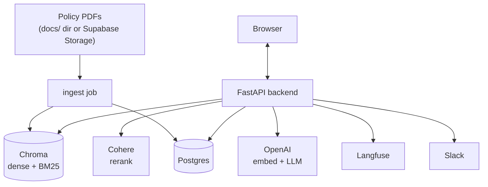
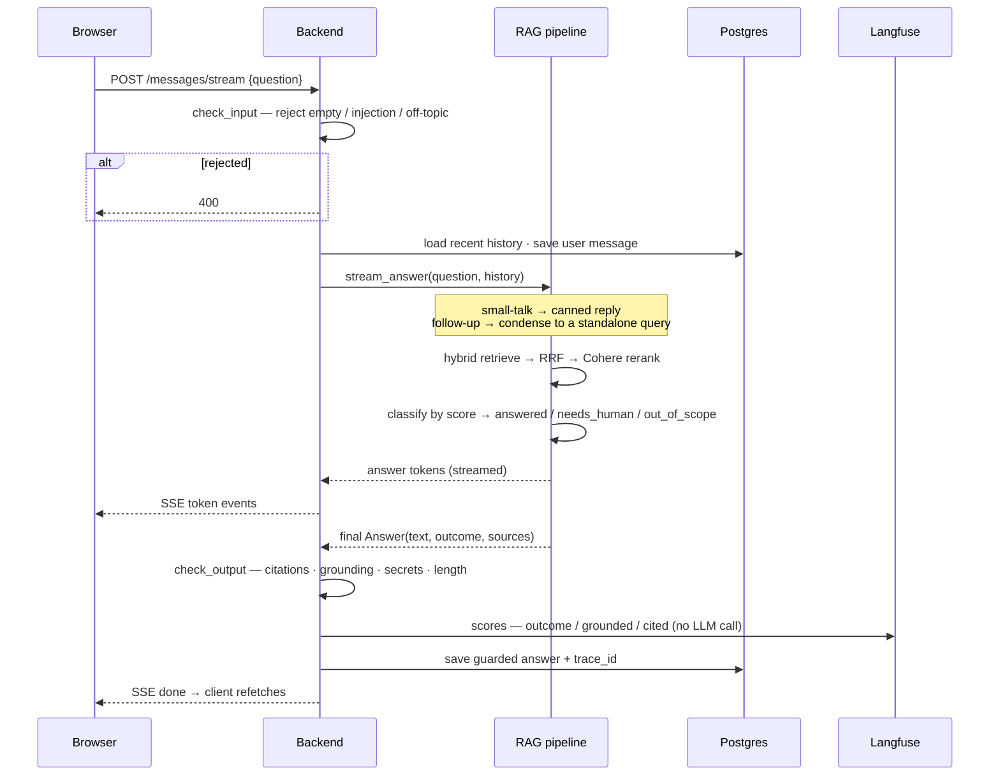
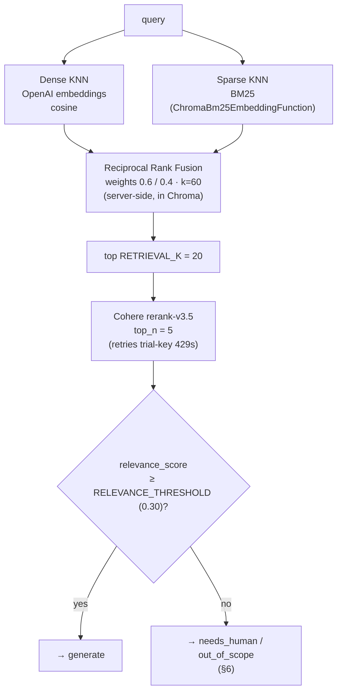
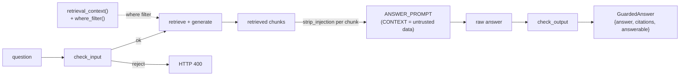
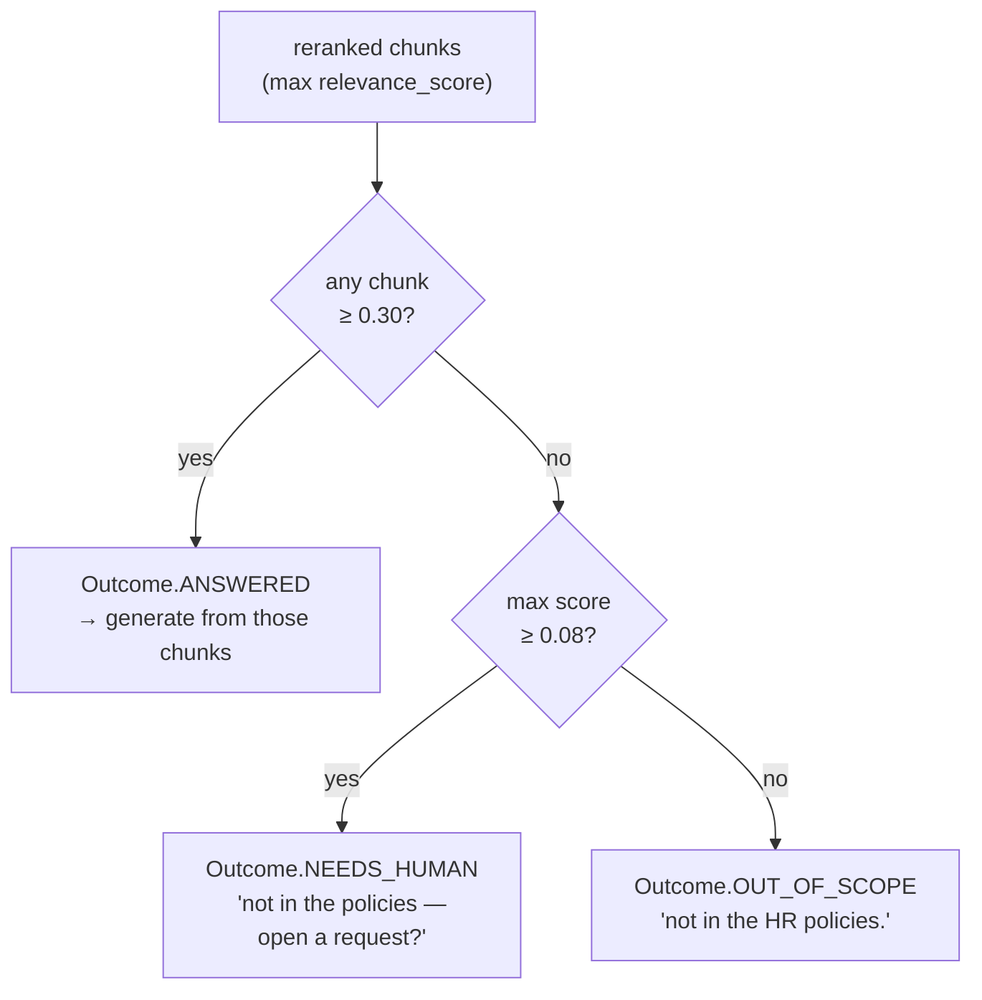
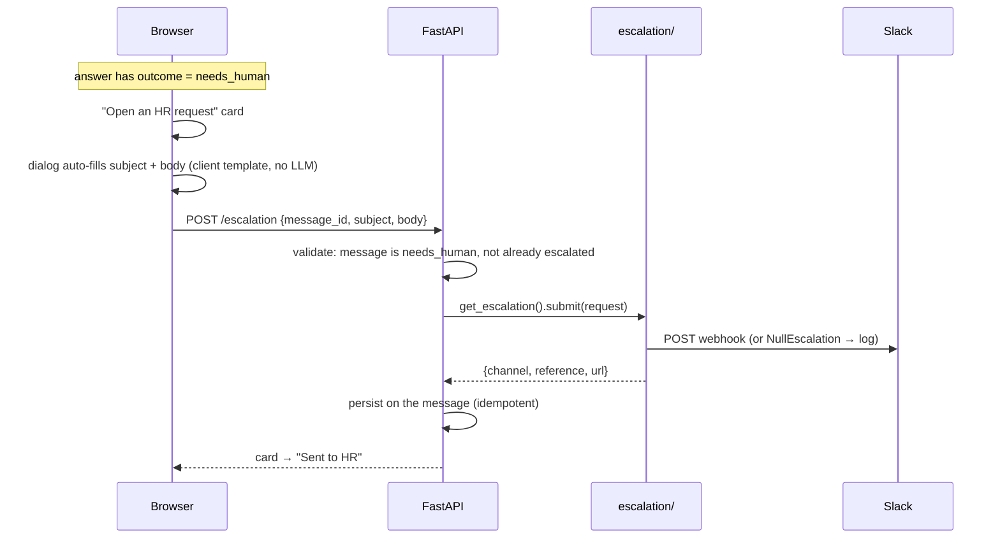
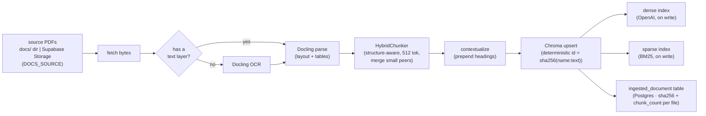
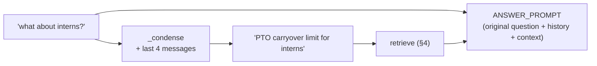
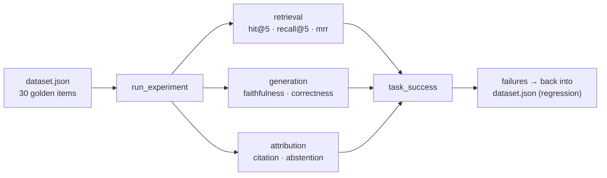
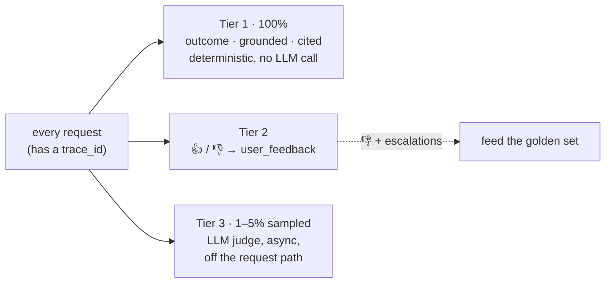

# HR-RAG — Architecture

An HR assistant that answers questions about company policy PDFs with **grounded,
cited** answers. It knows the three things it can do with a question — **answer**
it from the documents, **decline** it as out of scope, or **escalate** it to a
human — and it decides which deterministically, never by trusting the model to
"know when it doesn't know."

| | |
|---|---|
| **Backend** | FastAPI · LangChain (thin wrappers only) · Chroma Cloud (hybrid search) · Cohere (rerank) · OpenAI (embeddings + GPT-4o-mini) · Postgres/SQLModel · Langfuse |
| **Frontend** | React 19 · TypeScript · Vite · Tailwind · TanStack Query · SSE streaming |
| **Shape** | A **RAG workflow**, not an agent — a fixed pipeline with one branch that takes an action (Slack handoff). No LLM-driven control flow. |

> Diagrams render on GitHub — hover a diagram and use the zoom control (top-right)
> to open it full-screen.

---

## 1. System context



External services are all optional to *run* the app: without Langfuse keys
tracing is a no-op, without a Slack webhook escalations just log, and the DB can
be local SQLite.

---

## 2. Repository layout

```
backend/src/
├── app.py            every FastAPI route (nothing else)
├── streaming.py      the SSE answer pipeline
├── config.py         settings from .env
├── schemas.py        request/response models — the API contract
├── tracing.py        Langfuse callback + online scores (no-op without keys)
├── rag/
│   ├── chain.py       condense → classify → generate / abstain / escalate
│   ├── retriever.py   hybrid search (dense + BM25 + RRF) + Cohere rerank
│   ├── prompts.py     LLM prompt templates
│   ├── vectorstore.py Chroma Cloud client + dense/sparse schema
│   ├── storage.py     source PDFs — local docs/ dir or Supabase Storage bucket
│   └── ingest.py      fetch → Docling → HybridChunker → upsert
├── guardrails/
│   ├── input.py       empty / length / off-topic / prompt-injection / small-talk
│   ├── output.py      empty / length / citation validation / grounding / secret redaction
│   └── authorization.py  retrieval tenant/role filter boundary (interface + stub)
├── escalation/       Escalation protocol · null (default) · slack
└── db/               SQLModel tables · engine · query functions

frontend/src/
├── app/              providers · router · error boundary · 3-pane layout
├── features/
│   ├── conversations/   api · hooks · components/{chat, sidebar, escalation}
│   └── workspace/       api · hooks · components
├── lib/              api-client · sse · cn · format
└── types/            domain types
```

**Feature-sliced frontend**: features own `api / components / hooks`, never import
each other, and compose only in `app/layout/`. `lib/api-client.ts` is the single
place that calls `fetch`.

---

## 3. Answering a question — the core flow

`POST /api/conversations/{id}/messages/stream` → Server-Sent Events.



*(`Backend` = `app.py` route + `streaming.py`; `RAG pipeline` = `rag/chain.py` +
`rag/retriever.py`.)*

Stage by stage:

| stage | where | what |
|---|---|---|
| **Input guardrails** | `guardrails/input.check_input` | Reject empty / too-short / too-long / obvious prompt-injection / clearly-off-topic questions → **400** before any work. Greetings get a canned reply with no retrieval. |
| **Condense** | `chain._condense` | On a follow-up, one cheap LLM call rewrites *"what about interns?"* into a standalone query using the last 4 turns. Skipped when there's no history. |
| **Retrieve + rerank** | `retriever.retrieve` | See §4. Returns chunks each carrying a Cohere `relevance_score`. |
| **Classify** | `chain._retrieve_relevant` | Two-tier threshold on the scores → `answered` / `needs_human` / `out_of_scope`. See §6. |
| **Generate** | `chain` + `prompts.ANSWER_PROMPT` | Only if `answered`. Streams tokens. Prompt frames CONTEXT as **untrusted data**. `max_tokens` caps length at generation time. |
| **Output guardrails** | `guardrails/output.check_output` | Strip fabricated citations, replace obviously-ungrounded answers, redact secrets, cap length → a validated `{answer, citations, answerable}`. See §5. |
| **Score** | `streaming._score` → `tracing.score` | Deterministic monitoring signals to Langfuse — no LLM call. |
| **Persist + stream done** | `db/store` | Guarded answer + `outcome` + `trace_id` saved; client refetches. |

The raw stream shows the model's tokens live; the **guarded** version replaces
them when the client refetches on `done`.

---

## 4. Retrieval pipeline



- **Hybrid, not just dense** — dense retrieval misses exact terms (a policy
  number, a specific benefit name); BM25 catches them. RRF fuses the two ranked
  lists without needing comparable score scales.
- **Fusion runs inside Chroma** (its `Search`/`Rrf`/`Knn` API), so one round trip
  returns the fused list.
- **Rerank** is the precision step — a cross-encoder that actually reads
  query + chunk together, cutting 20 candidates to the 5 most on-point.
- **`where`** is threaded through the whole path — it's the authorization filter
  (§5), currently always `None`.

---

## 5. Guardrail layer

Guardrails wrap the pipeline without touching it. Faithfulness/citation
*evaluation* lives in `evaluation/` and is **not** duplicated here — the runtime
checks only catch obvious failures.



| # | guardrail | runs | mechanism |
|---|---|---|---|
| 1 | empty / whitespace | input | deterministic |
| 2 | min / max length | input | constants |
| 3 | off-topic | input | small deterministic denylist (retrieval abstention is the main defence) |
| 4 | prompt injection | input **and** prompt | regex denylist + `ANSWER_PROMPT` treats CONTEXT as data |
| 5 | empty output | output | → safe fallback |
| 6 | max output length | generation + output | `max_tokens` at generation, hard char cap as backstop |
| 7 | citation validation | output | every `[token]` must name a **retrieved** source; fabricated brackets stripped and logged |
| 8 | runtime grounding | output | lexical overlap of answer vs retrieved context; below a floor → safe fallback |
| 9 | authorization | retrieval | `RetrievalContext` → Chroma `where` filter (**interface + stub** — no auth system yet) |
| 10 | PII / secrets | output | regex for API keys / tokens / private keys → **redact** (emails untouched) |
| 11 | malicious retrieved content | prompt + retrieval | prompt boundary + `strip_injection` on each chunk |
| 12 | structured output | output | validated `GuardedAnswer` Pydantic model (validation, not structured *generation* — that would break streaming) |

---

## 6. Answer / abstain / escalate

The one interesting decision in the whole system, and it's **deterministic** —
made by code reading the reranker's scores, not by the LLM.



- *"can I expense a standing desk?"* pulls the equipment policy at ~0.15 — related,
  doesn't answer → **needs_human**.
- *"what is the capital of France?"* reranks at ~0.02 → **out_of_scope**, plain decline.

### Escalation flow



`get_escalation()` picks the backend from `ESCALATION_BACKEND` (`none` → logs,
`slack` → webhook). A Jira backend would be one file implementing the same
`submit()` — `EscalationResult` already carries `reference` / `url` for backends
that create a trackable ticket.

**Why not an agent / tool-calling?** The decision to escalate isn't the model's
(it's a score threshold), the model isn't even running when retrieval abstains,
and a write action needs explicit human confirmation. It becomes worth a
tool-calling agent (LangChain `bind_tools` / LangGraph) at 3–4 actions where the
model should *choose* between them mid-conversation. Nothing built here would be
wasted in that migration.

---

## 7. Ingestion



- **Source is pluggable** (`DOCS_SOURCE`): `local` reads `backend/docs/`,
  `supabase` pulls each PDF from a private Supabase Storage bucket over the
  Storage REST API with the service-role key (`src/rag/storage.py`).
- **Idempotent**: chunk ids are content hashes, and the manifest of file hashes
  means a re-run only processes new or changed PDFs. The manifest is a Postgres
  table (`ingested_document`), so it survives an ephemeral deploy and is shared
  across instances; each file's row is written right after its own upsert, so a
  run that fails partway keeps the work it finished. Truncate the table to force
  a full re-ingest.
- **Both indexes are populated by Chroma on write** from the chunk text — the
  sparse index is a schema property fixed at collection creation, so changing it
  means a new `COLLECTION_NAME`.
- **Triggered two ways**, both calling `run_ingestion()`: the CLI
  (`python -m src.rag.ingest`) or `POST /api/ingest`, which runs the same pipeline
  synchronously and returns a `{processed, skipped, chunks_upserted,
  collection_count}` summary.
- `/api/workspace`'s document list is read from `ingested_document`, not by
  scanning chunk metadata — Chroma Cloud caps a single `get()` at a few hundred
  rows, which silently drops documents past that.

---

## 8. Conversation memory

Persisted per conversation in Postgres. On a follow-up, `_condense` turns a
context-dependent question into a standalone one **for retrieval**; generation
still sees the original question plus the recent turns.



Last **4 messages verbatim** (`HISTORY_TURNS`), no summarization — HR chats are
short, and summarization is an optimization to add only when a token budget
actually bites.

---

## 9. Evaluation & observability

Two separate concerns, deliberately kept apart.

**Offline — the regression gate** (runs on deploy / weekly):



**Online — production, per request:**



- **Offline** runs on deploy / weekly. Latest run (30 items): `hit@5` 1.0,
  `recall@5` 0.96, `mrr` 0.94, `faithfulness` 0.89, `correctness` 0.89,
  `citation` 0.81, `abstention` 1.0, `task_success` 0.77.
- **The rule**: synchronous per-request scoring = deterministic + user feedback
  only. The LLM judge is sampled and async — you never pay judge cost or latency
  on the request path.
- Every request carries a Langfuse **trace id** (`Message.trace_id`), which is
  what the thumbs rating and the deterministic scores attach to.

---

## 10. Key design decisions

**Hybrid retrieval + rerank, not plain vector search.**
Dense embeddings miss exact terms; BM25 misses paraphrases. RRF fuses them
cheaply, and the reranker is the precision filter that a bi-encoder can't be.

**Deterministic abstention, not "trust the model to say I don't know."**
A relevance-score floor (`RELEVANCE_THRESHOLD`) decides whether to answer at all —
so the out-of-scope path costs no LLM call and can't hallucinate. LLMs are
unreliable at knowing the boundary of their retrieved context.

**Two thresholds, three outcomes.**
Splitting "no answer" into *off-topic* vs *in-scope-but-uncovered* is what makes
the human handoff sane — you don't file a ticket for "capital of France."

**A workflow, not an agent.**
Every branch is code or a fixed LLM step; no model-driven control flow. This is
more reliable and far easier to test and explain. The escalation module and the
retriever are already shaped as "tools" for the day an agent is worth it.

**Guardrails wrap the pipeline; evaluation doesn't run at request time.**
Runtime guardrails are cheap and deterministic (or one bounded LLM call for
condensing). Faithfulness/correctness judging is offline on a golden set, plus a
sampled async judge in production — never blocking a response.

**Prompts and canned copy live apart from logic.**
`rag/prompts.py` holds the templates; they're content that gets iterated on.

**Streaming everywhere, guarded on completion.**
Tokens stream for UX; the guarded answer is what gets persisted and re-rendered.

**No auth yet, but the boundary exists.**
`guardrails/authorization.py` is the single place tenant/role filtering plugs in —
`RetrievalContext` → a Chroma `where` filter, enforced at retrieval, never by the
LLM. Making it real needs request identity + access metadata on chunks.

**Serving and ingestion have different resource profiles.**
The API never imports Docling/torch — it's an optional dependency group, lazy-
loaded, only `POST /api/ingest` touches it. So the Docker image is serving-only
(~1 GB, one container: FastAPI + the built SPA); ingestion runs as a separate job
(`uv sync --group ingestion` + the CLI). One `pyproject.toml` group away from a
fully split serving / ingestion deployment.

---

## Appendix — API

| method | path | purpose |
|---|---|---|
| `GET` | `/api/health` | liveness |
| `GET` | `/api/workspace` | indexed-corpus summary (welcome screen) |
| `POST` | `/api/ingest` | re-scan `docs/` → upsert new/changed PDFs (runs the pipeline synchronously) |
| `GET` | `/api/conversations` | list (id, title, updated_at) |
| `POST` | `/api/conversations` | create (empty) |
| `GET` | `/api/conversations/{id}` | full conversation + messages |
| `POST` | `/api/conversations/{id}/messages/stream` | ask a question → SSE |
| `POST` | `/api/conversations/{id}/escalation` | human handoff (idempotent per message) |
| `POST` | `/api/feedback` | 👍/👎 → Langfuse score |
| `DELETE` | `/api/conversations/{id}` | delete (cascades to messages) |
