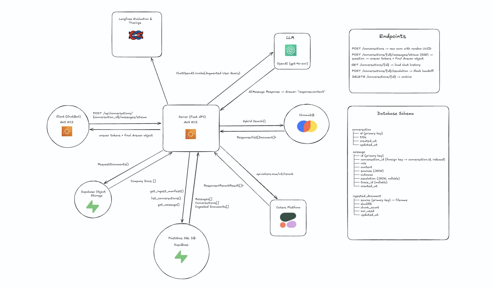
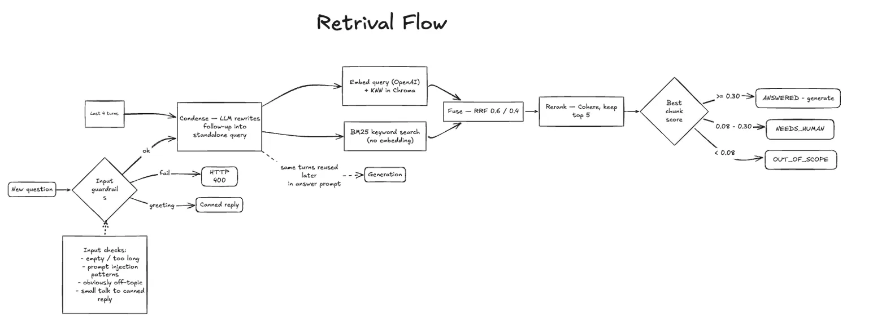
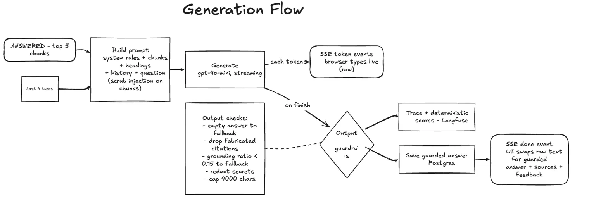
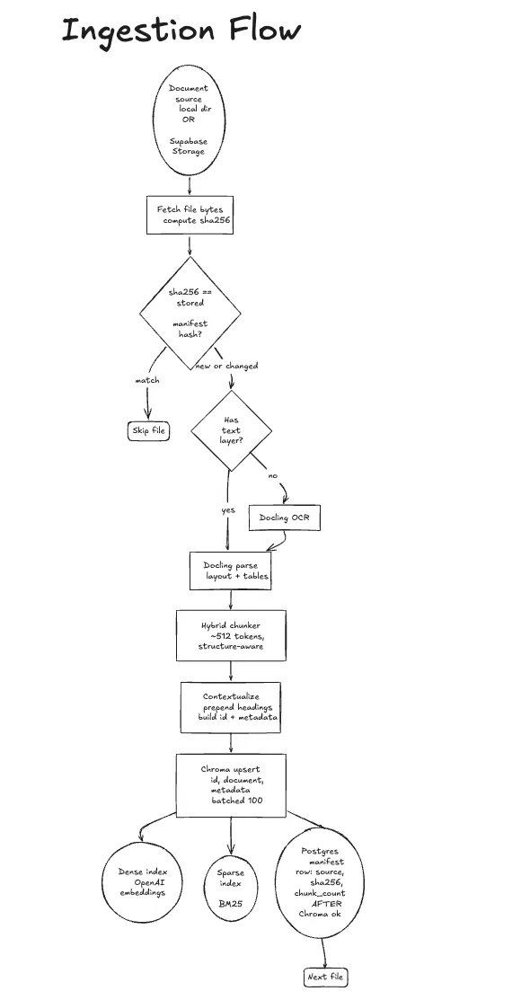
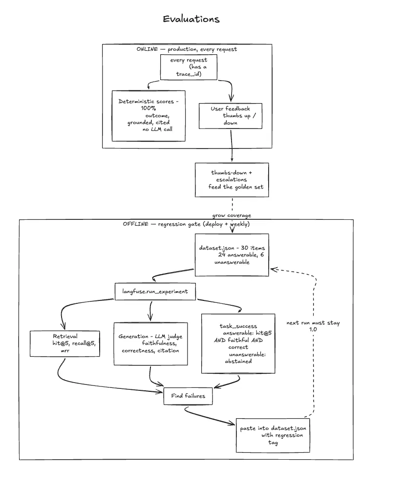

# HR-RAG — Architecture

An HR assistant that answers questions about company policy PDFs with **grounded,
cited** answers. It knows the three things it can do with a question — **answer**
it from the documents, **decline** it as out of scope, or **escalate** it to a
human — and it decides which deterministically, never by trusting the model to
"know when it doesn't know."

| | |
|---|---|
| **Backend** | FastAPI · LangChain (thin wrappers only) · Chroma Cloud (hybrid search) · Cohere (rerank) · OpenAI (embeddings + GPT-4o-mini) · Postgres/SQLModel · Langfuse |
| **Frontend** | React 19 · TypeScript · Vite · Tailwind · TanStack Query · SSE streaming |
| **Shape** | A **RAG workflow**, not an agent — a fixed pipeline with one branch that takes an action (Slack handoff). No LLM-driven control flow. |
| **Live** | app http://13.50.233.254/ · traces & evals [Langfuse](https://cloud.langfuse.com/project/cmtou71p00o0iad0dizk0uo79/traces) |

Each diagram's source is the `.mmd` file next to it in [`docs/img/`](img/).

---

## 1. System context



- **Client** — React SPA, one screen: chat, a conversation sidebar, a policy-coverage panel. Talks to the backend over JSON + SSE.
- **Server** — FastAPI on a single EC2 box (one Docker container, SPA served from the same origin). Owns the whole pipeline.
- **OpenAI** — query/document embeddings and the `gpt-4o-mini` answer model.
- **ChromaDB** — vector store holding the chunked policies; runs dense (embedding) and sparse (BM25) search and fuses them server-side.
- **Cohere** — reranker; re-scores the fused candidates against the question.
- **Postgres (Supabase)** — conversations, messages, and the ingestion manifest (`ingested_document`).
- **Supabase Object Storage** — the source policy PDFs (when `DOCS_SOURCE=supabase`; otherwise a local folder).
- **Langfuse** — one trace per request, plus deterministic scores and thumbs feedback; also runs the offline eval.

External services are optional to *run* the app: no Langfuse keys → tracing is a
no-op, no Slack webhook → escalations just log, and the DB can be local SQLite.

---

## 2. Repository layout

```
backend/src/
├── app.py            every FastAPI route (nothing else)
├── streaming.py      the SSE answer pipeline
├── config.py         settings from .env
├── schemas.py        request/response models — the API contract
├── tracing.py        Langfuse callback + online scores (no-op without keys)
├── rag/
│   ├── chain.py       condense → classify → generate / abstain / escalate
│   ├── retriever.py   hybrid search (dense + BM25 + RRF) + Cohere rerank
│   ├── prompts.py     LLM prompt templates
│   ├── vectorstore.py Chroma Cloud client + dense/sparse schema
│   ├── storage.py     source PDFs — local docs/ dir or Supabase Storage bucket
│   └── ingest.py      fetch → Docling → HybridChunker → upsert
├── guardrails/
│   ├── input.py       empty / length / off-topic / prompt-injection / small-talk
│   ├── output.py      empty / length / citation validation / grounding / secret redaction
│   └── authorization.py  retrieval tenant/role filter boundary (interface + stub)
├── escalation/       Escalation protocol · null (default) · slack
└── db/               SQLModel tables · engine · query functions

frontend/src/
├── app/              providers · router · error boundary · 3-pane layout
├── features/
│   ├── conversations/   api · hooks · components/{chat, sidebar, escalation}
│   └── workspace/       api · hooks · components
├── lib/              api-client · sse · cn · format
└── types/            domain types
```

**Feature-sliced frontend**: features own `api / components / hooks`, never import
each other, and compose only in `app/layout/`. `lib/api-client.ts` is the single
place that calls `fetch`.

---

## 3. Retrieval

`POST /api/conversations/{id}/messages/stream` → the request first has to get
*through the door* and turn into a good search query, then find the right chunks.



- **Input guardrails** — reject empty / over-length / prompt-injection / clearly
  off-topic questions with a **400** before any work; a greeting gets a canned
  reply with no retrieval.
- **Condense** — on a follow-up, one cheap LLM call rewrites *"what about
  interns?"* into a standalone query using the last 4 turns. Retrieval needs a
  self-contained query; skipped entirely on the first turn.
- **Embed + KNN** — the condensed query is embedded (OpenAI) and run as a
  nearest-neighbour search in Chroma. Catches paraphrases.
- **BM25** — the same query as keywords, no embedding. Catches exact terms a
  policy number, an acronym, a specific benefit name.
- **Fuse (RRF)** — Reciprocal Rank Fusion merges the two ranked lists by
  *position*, weighting dense `0.6` / sparse `0.4` (`k=60`), and keeps the top 20.
  Runs inside Chroma, one round trip.
- **Rerank** — Cohere reads query + chunk together and cuts 20 → 5. The precision
  step a bi-encoder can't be.
- **Score gate** — the best chunk's `relevance_score` decides the outcome
  deterministically: `≥ 0.30` → **answer**, `0.08–0.30` → **needs human**
  (offer a handoff), `< 0.08` → **out of scope** (plain decline). The LLM isn't
  running yet when we abstain, so the decline path costs nothing and can't
  hallucinate.

Authorization is a `where` filter threaded through this whole path
(`guardrails/authorization.py`) — the seam where tenant/role scoping plugs in,
enforced at retrieval, never by the LLM. Currently always `None`.

---

## 4. Generation

Only the `ANSWERED` path reaches here. `NEEDS_HUMAN` / `OUT_OF_SCOPE` skip
straight to a fixed reply.



- **Build prompt** — system rules + the 5 retrieved chunks (each tagged with its
  source, page and heading) + the recent turns + the question. Every chunk's text
  is run through `strip_injection` first, and the prompt frames CONTEXT as
  **untrusted data** — a poisoned PDF can't hijack the model.
- **Generate** — `gpt-4o-mini`, `temperature=0`, `max_tokens=800`, streamed.
- **SSE tokens** — each token is pushed to the browser as it's produced, so the
  answer types out live. This text is **raw** (pre-guardrail).
- **Output guardrails** — on the finished answer: empty → safe fallback · drop
  citations that don't name a retrieved source · lexical grounding below a floor →
  safe fallback · redact secrets (API keys, tokens) · hard char cap → a validated
  `{answer, citations}`.
- **Trace + scores** — a Langfuse span with the question / answer / context, plus
  deterministic scores (`outcome`, `grounded`, `cited`). No LLM call.
- **Save + done** — the guarded answer, its `outcome` and `trace_id` are
  persisted; the `done` SSE event tells the client to refetch, and the raw
  streamed text is replaced by the guarded version with sources and 👍/👎.

Conversation memory is the last 4 messages verbatim (`HISTORY_TURNS`), no
summarization — HR chats are short. History is used **twice**: to condense the
query for retrieval (§3) and here, so the answer's phrasing fits the thread.

---

## 5. Ingestion

Shared by the CLI (`python -m src.rag.ingest`) and `POST /api/ingest` — same
`run_ingestion()`, run synchronously, returning a
`{processed, skipped, chunks_upserted, collection_count}` summary.



- **Document source** — pluggable via `DOCS_SOURCE`: a local folder, or a private
  Supabase Storage bucket over the REST API with the service-role key.
- **Hash gate** — `sha256` of the file bytes vs the manifest row. Match → skip.
  This is what makes a re-run cheap: only new or changed PDFs are processed.
- **Text-layer check** — a scanned PDF with no text layer goes through Docling
  **OCR** first.
- **Docling parse** — layout- and table-aware extraction to structured document.
- **HybridChunker** — structure-aware chunks of ~512 tokens, merging small
  adjacent pieces.
- **Contextualize** — prepend the section headings to each chunk's text, build a
  **deterministic id** (`sha256(name:text)`) and metadata (`source`, `headings`,
  `page_no`, `ocr_used`).
- **Chroma upsert** — batched 100. Deterministic ids make re-runs idempotent and
  crash-safe. Chroma builds both the dense (OpenAI) and sparse (BM25) index from
  the chunk text on write.
- **Postgres manifest row** — `source`, `sha256`, `chunk_count`, written **after**
  that file's Chroma upsert succeeds and committed per file. A run that dies
  partway keeps the work it finished; truncate the table to force a full
  re-ingest.

*Known limitation:* editing one policy inside an otherwise-unchanged PDF leaves
the old chunks in place (new text → new ids → inserted, old ids never deleted).
The fix is `collection.delete(where={"source": name})` before re-upsert when the
hash changes — deliberately not added yet.

---

## 6. Evaluation & observability

Two separate concerns, deliberately kept apart: an **offline** golden-set gate,
and cheap **online** signals that never add an LLM call to the request path.



**Offline — the regression gate** (`langfuse.run_experiment`, manual / weekly):

- 30-item `dataset.json` — 24 answerable, 6 unanswerable.
- **Retrieval** metrics: `hit@5`, `recall@5`, `mrr`.
- **Generation** metrics (LLM judge): `faithfulness`, `correctness`, `citation`.
- **`task_success`** per item: an answerable item must retrieve the right chunk
  *and* be faithful *and* be correct; an unanswerable item must abstain.
- Failures are pasted back into `dataset.json` with a `regression` tag — from then
  on every run must keep `task_success` at **1.0** on those items (a fixed bug
  stays fixed).
- Latest run: `hit@5` 1.0 · `recall@5` 0.96 · `mrr` 0.94 · `faithfulness` 0.89 ·
  `correctness` 0.89 · `citation` 0.81 · `abstention` 1.0 · `task_success` 0.77.

**Online — every production request** (each carries a Langfuse `trace_id`):

- **Deterministic scores** on 100% of requests — `outcome`, `grounded` (lexical
  overlap), `cited` — computed from data we already have, no LLM call.
- **User feedback** — 👍/👎 posts a score onto the same trace.
- Thumbs-down answers and escalations are the pipeline for growing the golden set.

---

## 7. Key design decisions

**Hybrid retrieval + rerank, not plain vector search.**
Dense embeddings miss exact terms; BM25 misses paraphrases. RRF fuses them
cheaply, and the reranker is the precision filter a bi-encoder can't be.

**Deterministic abstention, not "trust the model to say I don't know."**
A relevance-score floor decides whether to answer at all — so the out-of-scope
path costs no LLM call and can't hallucinate.

**Two thresholds, three outcomes.**
Splitting "no answer" into *off-topic* vs *in-scope-but-uncovered* is what makes
the human handoff sane — you don't file a ticket for "capital of France."

**A workflow, not an agent.**
Every branch is code or a fixed LLM step; no model-driven control flow. More
reliable, far easier to test and explain. The escalation module and the retriever
are already shaped as "tools" for the day an agent is worth it (3+ real actions).

**Guardrails wrap the pipeline; evaluation doesn't run at request time.**
Runtime guardrails are cheap and deterministic. Faithfulness / correctness
judging is offline on a golden set — never blocking a response.

**Streaming everywhere, guarded on completion.**
Tokens stream for UX; the guarded answer is what gets persisted and re-rendered.

**No auth yet, but the boundary exists.**
`guardrails/authorization.py` is the single place tenant/role filtering plugs in —
`RetrievalContext` → a Chroma `where` filter, enforced at retrieval, never by the
LLM.

**Serving and ingestion have different resource profiles.**
The API never imports Docling/torch — it's an optional dependency group, lazy-
loaded, only `POST /api/ingest` touches it. So the Docker image is serving-only
(~1 GB, one container); ingestion runs as a separate job. One `pyproject.toml`
group away from a fully split deployment.

---

## Appendix — API

| method | path | purpose |
|---|---|---|
| `GET` | `/api/health` | liveness |
| `GET` | `/api/workspace` | indexed-corpus summary (welcome screen) |
| `POST` | `/api/ingest` | re-scan the source → upsert new/changed PDFs (runs the pipeline synchronously) |
| `GET` | `/api/conversations` | list (id, title, updated_at) |
| `POST` | `/api/conversations` | create (empty) |
| `GET` | `/api/conversations/{id}` | full conversation + messages |
| `POST` | `/api/conversations/{id}/messages/stream` | ask a question → SSE |
| `POST` | `/api/conversations/{id}/escalation` | human handoff (idempotent per message) |
| `POST` | `/api/feedback` | 👍/👎 → Langfuse score |
| `DELETE` | `/api/conversations/{id}` | delete (cascades to messages) |
